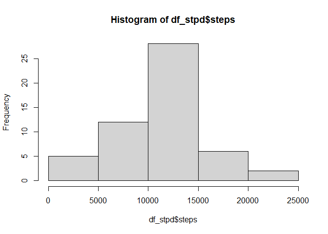
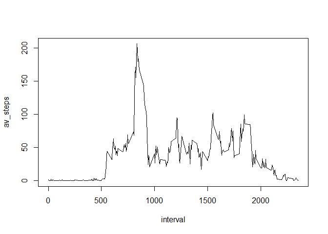
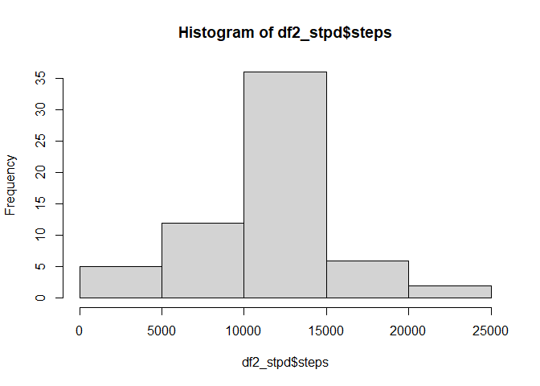
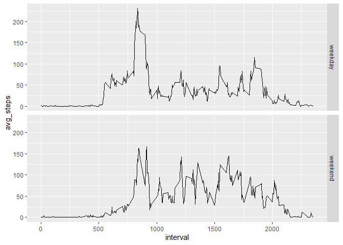

## Loading and preprocessing the data  

```r
if (!file.exists("activity.csv")){
    unzip("activity.zip")
}
df <- read.csv("activity.csv", header = TRUE )
```

## What is mean total number of steps taken per day?  


```r
df_stpd <- aggregate(df$steps, by = list(df$date), FUN = sum, na.rm = FALSE)
names(df_stpd) <- c("date","steps")
df_stpd
```

```
##          date steps
## 1  2012-10-01    NA
## 2  2012-10-02   126
## 3  2012-10-03 11352
## 4  2012-10-04 12116
## 5  2012-10-05 13294
## 6  2012-10-06 15420
## 7  2012-10-07 11015
## 8  2012-10-08    NA
## 9  2012-10-09 12811
## 10 2012-10-10  9900
## 11 2012-10-11 10304
## 12 2012-10-12 17382
## 13 2012-10-13 12426
## 14 2012-10-14 15098
## 15 2012-10-15 10139
## 16 2012-10-16 15084
## 17 2012-10-17 13452
## 18 2012-10-18 10056
## 19 2012-10-19 11829
## 20 2012-10-20 10395
## 21 2012-10-21  8821
## 22 2012-10-22 13460
## 23 2012-10-23  8918
## 24 2012-10-24  8355
## 25 2012-10-25  2492
## 26 2012-10-26  6778
## 27 2012-10-27 10119
## 28 2012-10-28 11458
## 29 2012-10-29  5018
## 30 2012-10-30  9819
## 31 2012-10-31 15414
## 32 2012-11-01    NA
## 33 2012-11-02 10600
## 34 2012-11-03 10571
## 35 2012-11-04    NA
## 36 2012-11-05 10439
## 37 2012-11-06  8334
## 38 2012-11-07 12883
## 39 2012-11-08  3219
## 40 2012-11-09    NA
## 41 2012-11-10    NA
## 42 2012-11-11 12608
## 43 2012-11-12 10765
## 44 2012-11-13  7336
## 45 2012-11-14    NA
## 46 2012-11-15    41
## 47 2012-11-16  5441
## 48 2012-11-17 14339
## 49 2012-11-18 15110
## 50 2012-11-19  8841
## 51 2012-11-20  4472
## 52 2012-11-21 12787
## 53 2012-11-22 20427
## 54 2012-11-23 21194
## 55 2012-11-24 14478
## 56 2012-11-25 11834
## 57 2012-11-26 11162
## 58 2012-11-27 13646
## 59 2012-11-28 10183
## 60 2012-11-29  7047
## 61 2012-11-30    NA
```

Histogram of total steps per day

```r
hist(df_stpd$steps)
```

<!-- -->
Calculation of the mean and median of total steps per day


```r
round(mean(df_stpd$steps, na.rm = TRUE), digits = 0)
```

```
## [1] 10766
```

```r
median(df_stpd$steps, na.rm = TRUE)
```

```
## [1] 10765
```

## What is the average daily activity pattern?


```r
df_itv <- aggregate(df$steps,by = list(df$interval), FUN = mean, na.rm = TRUE)
names(df_itv) <- c("interval","av_steps")
with(df_itv,plot(x = interval, y = av_steps, type = "l"))
```

<!-- -->

Present the interval with the highest average number of steps over the days


```r
df_itv[df_itv$av_steps == max(df_itv$av_steps),1]
```

```
## [1] 835
```


## Imputing missing values

Number of missing values in the dataset


```r
nrow(df[is.na(df$steps),])
```

```
## [1] 2304
```

Creating new dataframe df2, filling the NA interval values with the mean
of that interval


```r
df2 <- df
for (i in 1:nrow(df2)) {
    if (is.na(df2$steps[i])) {
        df2$steps[i] <- round(df_itv[df_itv$interval == df2$interval[i],2], 
                             digits = 0)
    }
}
```

Histogram of the total number of steps taken each day, based on the newly created dataset


```r
df2_stpd <- aggregate(df2$steps, by = list(df2$date), FUN = sum)
names(df2_stpd) <- c("date","steps")
hist(df2_stpd$steps)
```

<!-- -->

Mean and mediuan of total steps per day, based on the new dataset


```r
round(mean(df2_stpd$steps), digits = 0)
```

```
## [1] 10766
```

```r
median(df2_stpd$steps)
```

```
## [1] 10762
```

There is little effect from the NA replacement with the mean value:
*  The mean is the same: 10766
*  The median is two steps lower, from 10765 to 10763

## Are there differences in activity patterns between weekdays and weekends?

A calculated variable is created in the df2 dataframe: daytype

```r
for (i in 1:nrow(df2)) {
    if (weekdays(as.Date(df2$date[i])) %in% c("Saturday", "Sunday")) {
        df2$daytype[i] <- "weekend"}
    else {
        df2$daytype[i] <- "weekday"}
}
```

Then the interval data is aggregated where the mean nr of steps is calculated for both weekdays and weekend days. With this data a two-panel plot is made to make a comparison between the two types of days


```r
df3 <- aggregate(df2$steps,by = list(df2$interval, df2$daytype), FUN = mean)
names(df3) <- c("interval","daytype","avg_steps")

library(ggplot2)
g <- ggplot(data = df3,mapping = aes(x=interval,y=avg_steps))
g+geom_line()+facet_grid(rows=vars(daytype))
```

<!-- -->
